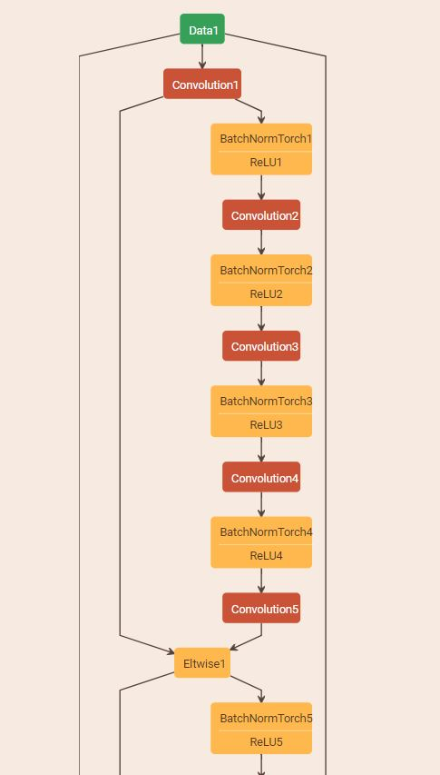

Balance Decoupled Spatial Convolutions (BDSC)
===========================
This is the implementation of "Balance Decoupled Spatial Convolutions" based on [Caffe](https://github.com/xieguotian/caffe)

1. layer: this folder contains the implementation of the 3x3 binary convolution.
2. [ResNet32_BDSC_CIFAR100.prototxt](http://dgschwend.github.io/netscope/#/gist/e731b2ba6490a0f7fb52d56efdf9dd60): a ResNet32 network with BDSC as basic building block. 

